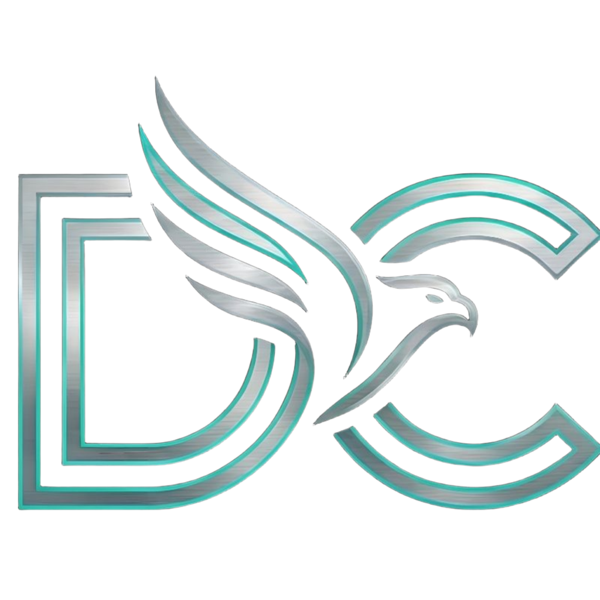

# Digital Craftify — Enterprise Digital Agency Web Platform

<p align="center">
  
</p>

<h3 align="center">Architecting Digital Excellence</h3>

<p align="center">
  <b>Digital Craftify</b> is a premier digital engineering & design agency web platform built with <b>Next.js 15 (App Router)</b>, <b>React 19</b>, <b>TypeScript</b>, and <b>Tailwind CSS</b>. It showcases custom web applications, mobile platforms, enterprise cloud solutions, interactive case studies, and an executive profile spotlight for Founder & CEO <b>Tanveer Hussain</b>.
</p>

<p align="center">
  <a href="https://www.digitalcraftify.com"></a>
  <a href="https://github.com/digitalcraftify5/dcow"></a>
  <a href="https://github.com/digitalcraftify5/dcow"></a>
  <a href="https://github.com/digitalcraftify5/dcow"></a>
  <a href="https://github.com/digitalcraftify5/dcow"></a>
</p>

---

## ✨ Key Features & Architecture

- **⚡ Next.js 15 & React 19 App Router**: Ultra-fast SSG static prerendering (`39/39 routes`) with seamless client-side page transitions.
- **🎨 Luxury Cyberpunk Design System**: Rich glassmorphism aesthetics, 60FPS dynamic HTML5 Canvas particle systems, custom shimmers, and dark mode theme engine.
- **📱 Progressive Web App (PWA)**:
  - 1-Tap native web app installation prompt (`InstallPwaPrompt`).
  - Step-by-step iOS Safari installation guide modal.
  - Keyboard shortcut bookmark helper (`Ctrl + D` / `⌘ + D`) and 1-click link copying.
- **📄 Executive PDF Resume & Corporate Profile Engine**:
  - Automated Node.js PDF generation for corporate profiles and 2-column cyber resumes (`Tanveer_Hussain_Resume.pdf`).
  - Interactive `DownloadConfirmationModal` with no-cache blob streaming to prevent browser caching errors.
- **📍 Founder Spotlight (`/founder`)**:
  - Dedicated executive profile for Founder & CEO **Tanveer Hussain**.
  - High-resolution suit headshot (`me.png`), calligraphy signature block, and real scannable QR code PNG (`founder-qr.png`).
- **🔍 Comprehensive SEO & Search Engine Indexing**:
  - Schema.org JSON-LD structured data (`Organization`, `Person`, `LocalBusiness`, `WebSite`, `OfferCatalog`).
  - Dynamic `sitemap.xml` indexing 39+ routes, `robots.txt`, and OpenGraph metadata.
- **💼 15+ Core Engineering Services**:
  - Web Development, Mobile App Development (Flutter/iOS/Android), UI/UX Design, Technical SEO, AI Agent & LLM Integrations, Edge Cloud Hosting, and Maintenance.

---

## 🛠️ Technology Stack

| Layer | Technology |
| :--- | :--- |
| **Framework** | Next.js 15.5+ (App Router, Static Export) |
| **UI Core** | React 19, TypeScript, Framer Motion, Lucide Icons |
| **Styling** | Tailwind CSS, CSS Custom Properties, Glassmorphism |
| **PWA** | Web App Manifest (`manifest.webmanifest`), Service Workers, Standalone Mode |
| **PDF Generation** | Node.js PDFKit & Canvas Scripting |
| **QR Code** | Node.js QRCode Engine |

---

## 📁 Directory Structure

```
dcow/
├── app/                        # Next.js App Router (39 Routes)
│   ├── about/                  # About Agency & Culture
│   ├── blog/                   # Technical Articles & Insights
│   ├── case-studies/           # Enterprise Client Case Studies
│   ├── contact/                # Contact Channels & Map
│   ├── founder/                # Founder Spotlight (Tanveer Hussain)
│   ├── portfolio/              # Interactive Project Showcase
│   ├── pricing/                # Service Packages & Estimates
│   ├── resources/              # Knowledge Base, Docs & Tutorials
│   ├── services/               # 15 Detailed Service Offerings
│   ├── layout.tsx              # Root Layout with JSON-LD & PWA Capsule
│   └── page.tsx                # Landing Page
├── components/                 # Reusable UI & Layout Components
│   ├── buttons/                # Custom Gradient & Glass Buttons
│   ├── hero/                   # High-Tech Hero Sections & Canvas
│   ├── layout/                 # Main Navbar, Footer, MegaMenu
│   ├── modals/                 # Founder, Download & Contact Modals
│   ├── seo/                    # Schema.org JSON-LD Generators
│   └── ui/                     # InstallPwaPrompt, Loader, Badges
├── constants/                  # Site Metadata & Contact Config
├── lib/                        # Metadata Constructor & Utilities
├── public/                     # Static Assets, Images, Logo, PDFs & QR
│   ├── founder-photo.jpg       # Tanveer Hussain Executive Headshot
│   ├── founder-qr.png          # Real Scannable QR Code PNG
│   ├── logo.png                # 3D Metallic Silver & Cyan DC Logo
│   ├── me.png                  # Executive Suit Photo
│   └── Tanveer_Hussain_Resume.pdf # Downloadable Executive Resume
├── scripts/                    # Automated PDF & QR Code Generators
└── out/                        # Production Static Export (39 HTML Pages)
```

---

## 🚀 Quick Start Guide

### Prerequisites
- Node.js `v18.0.0` or higher
- npm `v9.0.0` or higher

### 1. Clone the Repository
```bash
git clone https://github.com/digitalcraftify5/dcow.git
cd dcow
```

### 2. Install Dependencies
```bash
npm install
```

### 3. Run Development Server
```bash
npm run dev
```
Open [http://localhost:3000](http://localhost:3000) in your browser.

### 4. Build Production Static Export
```bash
npm run build
```
The optimized production export will be generated in the `out/` directory, ready to deploy to Hostinger, Vercel, Netlify, or CPanel.

---

## 👤 Founder & Leadership

- **Founder & CEO**: Tanveer Hussain
- **Agency Name**: Digital Craftify Ltd.
- **Phone / WhatsApp / BOTIM**: `+91 91494 55143`
- **Email**: `support@digitalcraftify.com`
- **Website**: [www.digitalcraftify.com](https://www.digitalcraftify.com)

---

## 🌐 Connect With Us

- **GitHub**: [github.com/digitalcraftify5](https://github.com/digitalcraftify5)
- **LinkedIn**: [linkedin.com/company/digitalcraftify5](https://linkedin.com/company/digitalcraftify5)
- **Facebook**: [facebook.com/digitalcraftify5](https://facebook.com/digitalcraftify5)
- **Instagram**: [instagram.com/digitalcraftify5](https://instagram.com/digitalcraftify5)
- **Discord**: [discord.gg/digitalcraftify5](https://discord.gg/digitalcraftify5)

---

<p align="center">
  © 2026 <b>Digital Craftify Ltd.</b> All rights reserved.
</p>
